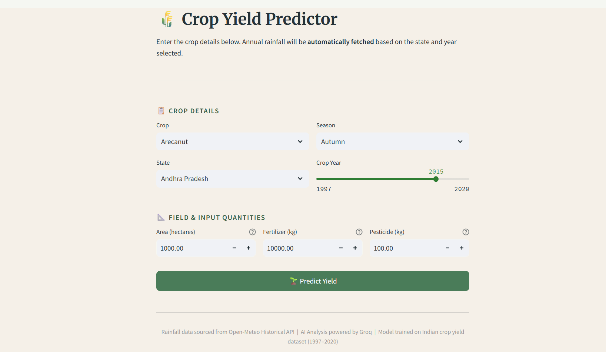
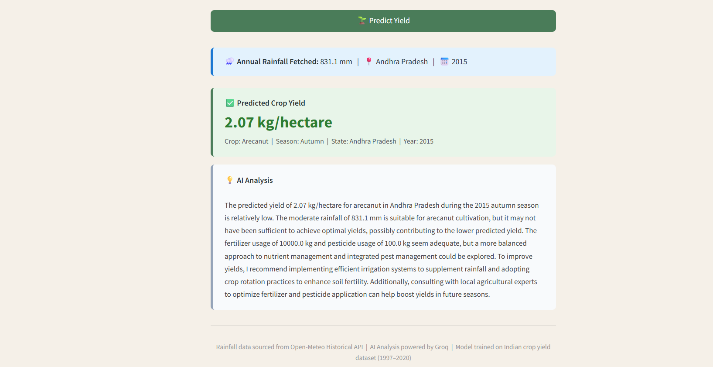

# 🌾 Crop Yield Predictor

   

---

## 🚀 Live Demo
[https://cropyieldprediction-lqbjdt5vd2676tmmuzq6sa.streamlit.app/](https://cropyieldprediction-lqbjdt5vd2676tmmuzq6sa.streamlit.app/)

---

## 📖 About
A machine learning-powered web application that predicts crop yield across 
30 Indian states and 55 crops using a Random Forest regression model with 
an R² score of 0.95.

The system eliminates manual rainfall input by automatically fetching 
historical annual rainfall for the selected state and crop year via the 
Open-Meteo Historical Weather API, and provides intelligent insights using 
an AI-powered analysis layer powered by Groq LLM.

This project combines machine learning, external API integration, and 
generative AI to deliver data-driven agricultural insights that can assist 
farmers and agricultural planners in making informed decisions.

---

## ✨ Features
- **Crop Yield Prediction** — Predicts yield in kg/hectare for 55 crops across 30 Indian states using a Random Forest Regressor with 95% accuracy
- **Automatic Rainfall Fetching** — Annual rainfall is automatically fetched from the Open-Meteo Historical Weather API based on the selected state and crop year — no manual input needed
- **AI-Powered Analysis** — Groq LLM (LLaMA 3.3 70B) generates a farmer-friendly analysis covering yield assessment, rainfall impact, fertilizer usage and practical recommendations
- **High Accuracy Model** — Random Forest Regressor trained on Indian crop yield data (1997–2020), achieving R² of 0.95, MAE of 0.65 and RMSE of 2.28
- **Clean Streamlit UI** — Intuitive interface with a professional agricultural theme, responsive layout and real-time spinners for API calls

---


## ⚙️ How It Works
```
User Input (Streamlit UI)
User enters: Crop, Season, State, Crop Year, Area, Fertilizer, Pesticide
          ↓
Rainfall Data Fetching
System auto-detects state coordinates and fetches historical rainfall data
using Open-Meteo API. Daily values are aggregated into annual rainfall (mm).
          ↓
Yield Prediction
All inputs + rainfall data are passed to a trained Random Forest model
which predicts crop yield (kg/hectare).
          ↓
AI Insights (Groq LLM)
Prediction and inputs are sent to LLaMA 3.3 (Groq API) to generate:
- Yield interpretation (low/moderate/high)
- Impact of rainfall
- Farming recommendations
          ↓
Display Results
User gets:
- Rainfall data
- Predicted yield
- AI-generated insights
```


---


## 🗂️ Project Structure
```
CropYieldPrediction/
│
├── .streamlit/
│   └── config.toml
│
├── data/
│   └── crop_yield.csv
│
├── model/
│   └── crop_yield_pipeline.pkl
│
├── notebooks/
│   └── CropYieldProduction.ipynb
│
├── utils/
│   ├── __init__.py
│   ├── preprocess.py
│   └── predict.py
│
├── .env
├── .gitattributes
├── .gitignore
├── app.py
├── config.py
├── requirements.txt
├── runtime.txt
```

---


## 🛠️ Tech Stack
| Layer | Technology |
|---|---|
| Frontend | Streamlit |
| ML Model | Scikit-learn (Random Forest Regressor) |
| Data Processing | Pandas, NumPy |
| Preprocessing | Scikit-learn (ColumnTransformer, OneHotEncoder, Pipeline) |
| Weather API | Open-Meteo Historical Archive API |
| AI Analysis | Groq LLM (LLaMA 3.3 70B Versatile) |
| Model Serialization | Joblib |

---

## 💻 Setup & Installation
**1. Clone the repository:**
```bash
git clone https://github.com/harshitachhabria18/CropYieldPrediction.git
cd CropYieldPrediction
```

**2. Create and activate virtual environment:**
```bash
python -m venv venv

# Windows
venv\Scripts\activate

# Mac/Linux
source venv/bin/activate
```

**3. Install dependencies:**
```bash
pip install -r requirements.txt
```

**4. Add your Groq API key:**

Create a `.env` file in the root directory:
```
GROQ_API_KEY=your_groq_api_key_here
```
Get a free API key at [console.groq.com](https://console.groq.com)

**5. Add the trained model:**

Run all cells in `notebooks/CropYieldProduction.ipynb` to generate:
model/crop_yield_pipeline.pkl

**6. Run the app:**
```bash
streamlit run app.py
```

---

## 📊 Model Performance
| Metric | Score |
|---|---|
| R² Score | 0.9566 |
| MAE | 0.6533 |
| RMSE | 2.2829 |

**Model:** Random Forest Regressor  
**Training Data:** 1997 – 2020 | 30 States | 55 Crops | 6 Seasons  
**Train/Test Split:** 80% training — 20% testing


---


## 📡 How Rainfall Fetching Works
1. User selects **State** and **Crop Year**
2. App looks up the state's **latitude/longitude** from `config.py`
3. Calls **Open-Meteo Historical Archive API** with `start_date = YEAR-01-01` and `end_date = YEAR-12-31`
4. Sums up all 365 daily `precipitation_sum` values
5. Passes the **annual total rainfall (mm)** directly to the model

---


## 📝 Dataset
- **Source:** Indian Crop Production Statistics
- **Period:** 1997 – 2020
- **Coverage:** 30 Indian states, 55 crops, 6 seasons
- **Features:** Crop, Crop Year, Season, State, Area, Annual Rainfall, Fertilizer, Pesticide
- **Target:** Yield (kg/hectare)


---


## 🔮 Future Enhancements
- **Satellite Data Integration** — Add NDVI and NDMI satellite indices to capture real-time crop health and soil moisture for improved prediction accuracy
- **Real-time Crop Year** — Support crop years beyond 2020 using Open-Meteo forecast data
- **Yield Trend Analysis** — Show historical yield trends for a selected crop and state over the years
- **Interactive Map** — Visualize predicted yield across Indian states on an interactive map
- **Crop Comparison** — Compare predicted yield of multiple crops side by side for the same inputs


---


## 📸 Screenshots




---


## 👨‍💻 Author
**Harshita Chhabria**
